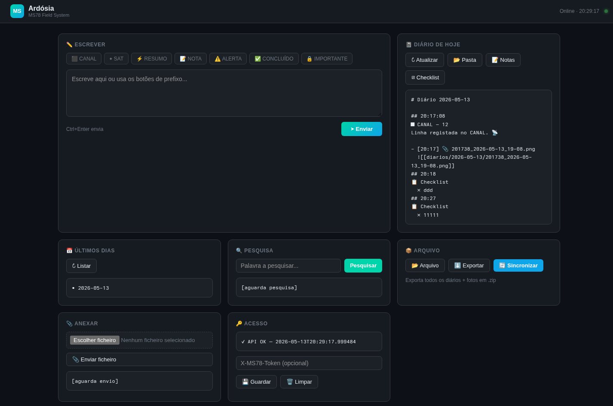
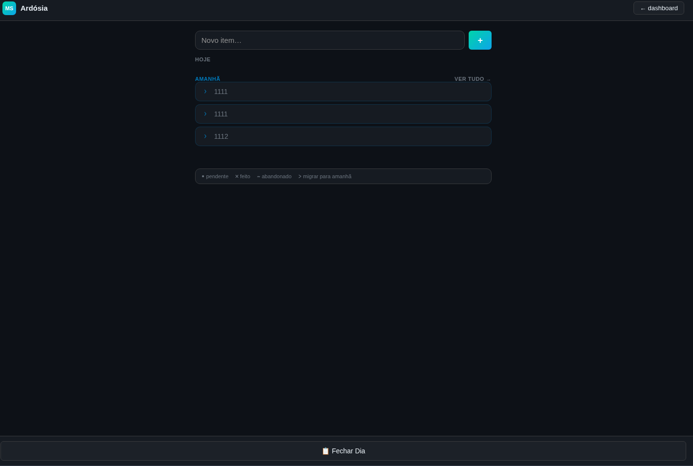
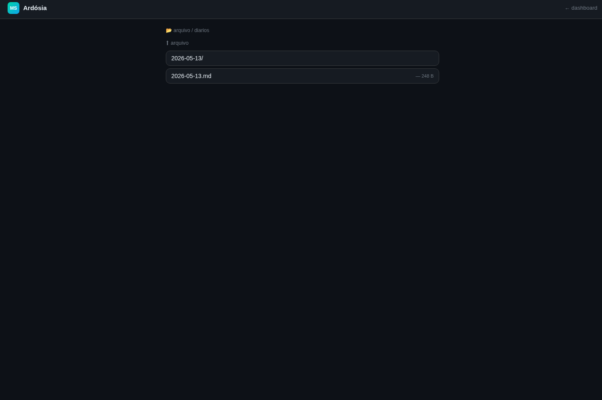

# Ardósia

Caderno pessoal com diários, notas rápidas e arquivo de fotos. Interface web, API Flask, suporte Docker.



| Checklist | Arquivo |
|---|---|
|  |  |

## O que faz

- Envia notas com prefixo (CANAL, SAT, RESUMO, NOTA, ALERTA, IMPORTANTE)
- Guarda tudo em ficheiros `.md` diários (`YYYY-MM-DD.md`)
- **Checklist** estilo caderno japonês — items com `•` `×` `~` `>`
- **Plano** — vista por dia com navegação ← → entre dias
- Arquivo de fotos via upload
- Exporta todos os diários + fotos num ZIP
- Sincroniza para outro PC via rsync (botão no dashboard)
- PWA — instala no telemóvel como app (Android/iOS)

## Páginas

| Rota | Descrição |
|---|---|
| `/dashboard` | Painel principal |
| `/notas` | Envio rápido de notas com prefixos |
| `/checklist` | Checklist do dia — sistema japonês |
| `/plano` | Vista por dia com navegação entre dias |
| `/arquivo/` | Navegador de ficheiros do caderno |

## Sistema de prefixos

Cada nota começa com um prefixo que define o seu tipo. Permite filtrar, pesquisar e dar sentido ao diário depois.

| Prefixo | Uso |
|---|---|
| `canal:` | Registo de actividade de um canal de informação ou fonte específica |
| `sat:` | Observação externa — algo que chegou de fora, notícia, sinal, input |
| `resumo:` | Síntese de um bloco de trabalho ou do dia |
| `nota:` | Apontamento geral, ideia, pensamento |
| `alerta:` | Algo urgente ou a não esquecer |
| `importante:` | Informação crítica — fica marcada para referência futura |

### Fluxo típico

```
sat: vi artigo sobre X         ← chegou de fora
nota: preciso de investigar X  ← reacção pessoal
canal: X confirmado via fonte Y ← cruzamento com canal
alerta: prazo para X é sexta   ← acção pendente
resumo: investigação X concluída, decisão: Y ← fecho do ciclo
```

Os prefixos são livres — adapta ao teu sistema. O que importa é a consistência ao longo do tempo.

## Checklist — sistema japonês

A checklist usa símbolos do Bullet Journal:

| Símbolo | Significado |
|---|---|
| `•` | Pendente |
| `×` | Feito |
| `~` | Abandonado (já não faz sentido) |
| `>` | Migrar para amanhã (decidiste adiar) |

No final do dia usa **Fechar Dia** — os `×` e `~` ficam registados no diário, os `>` passam automaticamente para amanhã. Items de dias anteriores não resolvidos aparecem com aviso no topo.

O `/plano` permite ver e editar a checklist de qualquer dia com navegação ← →.

## Instalação com Docker

```bash
git clone <url> ardosia
cd ardosia
cp .env.example .env
# edita .env com o teu editor
docker compose up -d
```

> Em sistemas mais antigos usa `docker-compose` (com hífen) em vez de `docker compose`.

Abre `http://<ip-da-maquina>:8787/dashboard`

## Configuração (.env)

| Variável | Descrição | Exemplo |
|---|---|---|
| `MS78_API_TOKEN` | Token de acesso à API | `token_secreto` |
| `VAULT_PATH` | Pasta local dos diários | `./caderno` ou `/mnt/disco/caderno` |
| `SYNC_TARGET` | Destino rsync (opcional) | `user@192.168.1.x:/caminho/caderno` |
| `PUID` | UID do utilizador do host | `1000` (descobrir com `id -u`) |
| `PGID` | GID do utilizador do host | `1000` (descobrir com `id -g`) |

O `VAULT_PATH` é montado como volume — os dados ficam fora do container. `PUID`/`PGID` garantem que os ficheiros criados pelo Docker ficam com as permissões correctas.

## Actualizar

```bash
git pull
docker compose down && docker compose up -d --build
```

## Sem Docker

```bash
pip install flask==2.3.3 werkzeug==2.3.7 pillow
export MS78_API_TOKEN=token_secreto
export VAULT_PATH=./caderno
python3 ms78_api.py
```

## Compatibilidade

| Plataforma | Docker | Direto |
|---|---|---|
| Linux / Mac / Windows WSL | ✅ | ✅ |
| Raspberry Pi 3 / 4 (ARM64) | ✅ | ✅ |
| Raspberry Pi Zero W (ARMv6) | ❌ | ✅ |
| Android (Termux) | ❌ | ✅ |

## PWA — instalar no telemóvel

**Android:** Chrome → menu (⋮) → "Adicionar ao ecrã principal"  
**iOS:** Safari → partilha → "Adicionar ao ecrã de início"

Funciona em HTTP na rede local (não precisa de HTTPS).

## Estrutura dos dados

A pasta `caderno/` já está incluída no projecto com as subpastas necessárias. As restantes são criadas automaticamente pela API.

```
caderno/
├── diarios/          ← gerido pela API (automático)
│   ├── 2026-05-13.md
│   └── 2026-05-14.md
├── checklist.json    ← dados da checklist (automático)
├── satelites/        ← uso manual (opcional)
└── canais/           ← uso manual (opcional)
```

**`diarios/`** — cada dia tem o seu `.md` com todas as notas do dia.

**`satelites/`** e **`canais/`** — pastas livres para ficheiros manuais. Cria um `.md` por satélite ou canal. Acessíveis via `/arquivo/satelites/` e `/arquivo/canais/` no browser.

Os ficheiros `.md` são compatíveis com Obsidian, VS Code, etc.

## Sincronização

O botão **Sincronizar** no dashboard faz rsync para `SYNC_TARGET`.  
Requer chave SSH configurada sem password:

```bash
ssh-keygen -t ed25519   # se ainda não tens chave
ssh-copy-id user@destino
```
